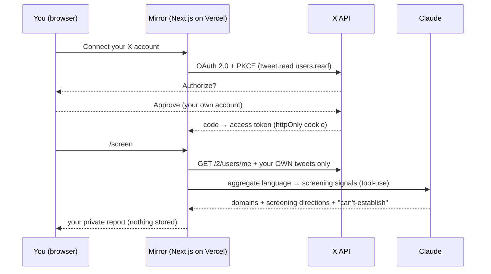

<div align="center">

# 🪞 Mirror

**A consent-locked self-screening companion.**
Connect your *own* X account and privately see the symptom-domain **signals** in your own posts —
mapped to validated screeners and the DSM-5 criteria they relate to.

[](https://github.com/acuestamd/mirror/actions/workflows/ci.yml)
[](./LICENSE)
[](./ETHICS.md)


</div>

> [!IMPORTANT]
> **Screening signals, not a diagnosis.** A screen is not a diagnosis, and short public posts cannot
> establish DSM-5 duration, pervasiveness, impairment, or rule-outs. Mirror is an educational,
> non-clinical tool. If anything it surfaces resonates, talk to a clinician — not this page.
> In crisis? In the US, call or text **988**.

## Why this exists — and the consent lock

It is trivial to make an LLM emit a confident "diagnosis" from someone's tweets. It is also invalid,
stigmatizing, and — pointed at a named, non-consenting person — a defamation and harassment engine.
So Mirror is built the opposite way:

> **You can only ever screen yourself.** Server-side, Mirror calls only `GET /2/users/me` and reads
> *that* user's own tweets. There is no field to type someone else's handle and no code path to fetch
> one. **Signing in is the consent.**

Tweets are analyzed for a single request and **never stored**. The Anthropic key stays server-side.
See [ETHICS.md](./ETHICS.md) — removing the consent lock is explicitly out of scope.

## What you see

- **Symptom-domain signals** — e.g. low mood, anxiety, sleep disruption — each with a strength,
  the validated screener it maps to (PHQ-9, GAD-7, ISI, …), the DSM-5 criterion area, and a confidence.
- **Candidate screening directions** — with a column for *what the text cannot establish*, which is the
  honest gap between language and a diagnosis.
- On an ordinary timeline, it usually surfaces **little or nothing** — which is the correct result.

## How it works



## Quickstart

```bash
git clone https://github.com/acuestamd/mirror && cd mirror
npm install
cp .env.example .env.local   # fill in the four values below
npm run dev                  # http://127.0.0.1:3000
```

### Deploy

[](https://vercel.com/new/clone?repository-url=https%3A%2F%2Fgithub.com%2Facuestamd%2Fmirror&env=X_CLIENT_ID,X_CLIENT_SECRET,X_REDIRECT_URI,ANTHROPIC_API_KEY&envDescription=X%20OAuth%202.0%20app%20credentials%20%2B%20Anthropic%20API%20key&project-name=mirror&repository-name=mirror)

1. Create an **X OAuth 2.0 app** at [developer.x.com](https://developer.x.com) → *Projects & Apps*:
   type **Web App / Confidential**, scopes `tweet.read users.read offline.access`, callback
   `https://<your-deployment>/api/callback` (reading tweets needs a paid X API tier).
2. Set the environment variables:

   | Variable | Description |
   |---|---|
   | `X_CLIENT_ID` | OAuth 2.0 client ID |
   | `X_CLIENT_SECRET` | OAuth 2.0 client secret |
   | `X_REDIRECT_URI` | `https://<your-deployment>/api/callback` (use `http://127.0.0.1:3000/api/callback` for dev) |
   | `ANTHROPIC_API_KEY` | Anthropic API key (server-only) |

## Project structure

```
app/
  page.tsx              landing + consent-lock explainer
  screen/page.tsx       your result (client-rendered)
  api/login             start OAuth (PKCE + state)
  api/callback          verify state, exchange code, set session cookie
  api/screen            read YOUR OWN timeline → screening signals
  api/logout            clear session
lib/
  twitter.ts            X OAuth 2.0 + read helpers (users/me + own tweets only)
  screen.ts             Claude screening engine (tool-use, structured output)
  pkce.ts               PKCE + state
```

## Scope & limitations

- Public timelines are curated and incomplete — **absence of signal is not evidence of wellbeing.**
- The signals are population-level correlates, **not** valid indicators about any individual.
- Not a medical device; not affiliated with X, the APA, or any health authority.

## Contributing

PRs welcome — see [CONTRIBUTING.md](./CONTRIBUTING.md) and the [Code of Conduct](./CODE_OF_CONDUCT.md).
Security issues: [SECURITY.md](./SECURITY.md). Ethical boundaries: [ETHICS.md](./ETHICS.md).

## License

[MIT](./LICENSE).
